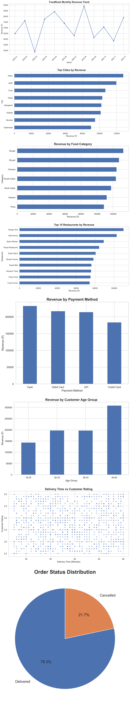

# Sales Data Analysis Using Python
This project repository contains three data analysis mini-projects:

1. Sales Data Analysis – analyzed sales data, calculated total & average sales, and created bar chart visualizations.
2. Department Salary Analysis – analyzed department-wise salary distribution and compared average salaries.
3. Customer Purchase Analysis – analyzed customer purchase behavior and identified top customers based on spending.

Tools used: Python, Pandas, NumPy, Matplotlib.

Key skills: Data cleaning, data analysis, data visualization, business insights.

# Power BI Sales Dashboard

4. This project analyzes sales data using Power BI.

Tools Used:
- Power BI
- Excel / CSV Data

Key Insights:
- Total Sales: ₹118M
- Total Units Sold: 1.13M
- Total Profit: ₹16.89M

Dashboard includes:
- Sales by Product and Country
- Sales by Segment
- Monthly Sales Trend

- ## Dashboard Preview


# 📊 Power BI Sales Insights Dashboard

## 🔹 Overview

This project presents an interactive Sales Dashboard built using Power BI. It helps in analyzing sales performance across different cities, products, and categories.


## 🔹 Tools & Technologies Used

* Power BI
* Microsoft Excel

## 🔹 Key Features

* 📌 Total Sales, Orders, and Quantity KPIs
* 📌 Sales analysis by City & Product
* 📌 Category-wise Sales Distribution
* 📌 Sales Trend over Time
* 📌 Interactive Filters (City-wise selection)

## 🔹 Key Insights

* 💡 Laptop is the top-selling product
* 💡 Mumbai generates the highest sales
* 💡 Majority of sales come from Laptop category (~69%)
* 💡 Sales show fluctuations over different dates


## 🔹 Dashboard Preview


## 🔹 How to Use

1. Download the `.pbix` file
2. Open in Power BI Desktop
3. Interact with filters and visuals


## 🔹 Author

**Rankit Kumar**


# 🍔 FoodRush – Customer & Delivery Analytics

## 📌 Project Overview

FoodRush is a Data Analytics portfolio project focused on analyzing customer orders, revenue, restaurant performance, payment methods, delivery performance, and customer behavior.

The project uses Python to clean, analyze, visualize, and generate actionable business insights from food delivery order data.

---

## 🎯 Business Objective

The main objective of this project is to understand:

* Overall revenue and order performance
* Top-performing cities
* Best food categories
* Top restaurants by revenue
* Monthly revenue trends
* Customer age-group behavior
* Payment method performance
* Delivery performance
* Order cancellation rate
* Relationship between delivery time and customer ratings

---

## 🛠️ Tools & Technologies

* **Python**
* **Pandas**
* **NumPy**
* **Matplotlib**
* **Seaborn**
* **Jupyter / VS Code**
* **GitHub**

---

## 🧹 Data Cleaning

The following data-cleaning activities were performed:

* Converted order dates into datetime format
* Removed duplicate records
* Identified missing values
* Filled missing ratings using median values
* Filled missing delivery times using median values
* Filled missing discounts using median values
* Created additional analytical columns

---

## 📊 Key Performance Indicators (KPIs)

The project calculates:

| KPI                   | Description                      |
| --------------------- | -------------------------------- |
| Total Orders          | Total number of unique orders    |
| Total Revenue         | Total order value generated      |
| Total Customers       | Number of unique customers       |
| Average Order Value   | Average revenue per order        |
| Average Rating        | Average customer rating          |
| Average Delivery Time | Average delivery time in minutes |
| Cancellation Rate     | Percentage of cancelled orders   |

---

## 📈 Analysis Performed

### 🏙️ City Performance

Analyzed total revenue generated by each city and identified the highest-performing cities.

### 🍔 Food Category Performance

Compared revenue across different food categories to identify the strongest revenue-generating category.

### 🏆 Restaurant Performance

Identified the top 10 restaurants based on total revenue.

### 📅 Monthly Revenue

Analyzed monthly revenue trends to understand business growth and fluctuations over time.

### 💳 Payment Analysis

Compared order volume and revenue across different payment methods.

### 👥 Customer Age Group

Analyzed customers and revenue across different age groups.

### 🚚 Delivery Performance

Analyzed order status and cancellation patterns.

### ⭐ Delivery Time vs Customer Rating

Studied the relationship between delivery time and customer ratings using a scatter plot.

---

## 📊 Visualizations

The project generates 8 analytical charts:

1. Monthly Revenue Trend
2. Top Cities by Revenue
3. Revenue by Food Category
4. Top 10 Restaurants
5. Revenue by Payment Method
6. Revenue by Customer Age Group
7. Delivery Time vs Customer Rating
8. Order Status Distribution

### 📌 Combined Dashboard



---

## 💡 Business Insights

The analysis identifies:

* Highest-performing city
* Highest-revenue food category
* Top-performing restaurant
* Most valuable payment method
* Highest-revenue customer age group
* Average customer rating
* Average delivery time
* Overall cancellation rate

These insights can help a food-delivery business improve customer experience, restaurant partnerships, delivery operations, and revenue performance.

---

## 📁 Project Structure

```text
FoodRush-Analytics/
│
├── foodrush_orders.csv
├── foodrush_analysis.py
├── FoodRush_Analytics_All_Charts.png
├── README.md
│
└── FoodRush_Charts/
    ├── 01_Monthly_Revenue.png
    ├── 02_City_Revenue.png
    ├── 03_Category_Performance.png
    ├── 04_Top_Restaurants.png
    ├── 05_Payment_Methods.png
    ├── 06_Age_Group.png
    ├── 07_Delivery_Time_vs_Rating.png
    └── 08_Order_Status.png
```

---

## 🚀 Skills Demonstrated

This project demonstrates practical experience with:

* Data Cleaning
* Exploratory Data Analysis (EDA)
* Data Aggregation
* KPI Development
* Business Analysis
* Data Visualization
* Python Programming
* Pandas & NumPy
* Matplotlib & Seaborn
* Business Insights Generation

---

## 👨‍💻 Author

**Rankit Singh**

Aspiring Data Analyst | Python | SQL | Power BI | Excel

---

## ⭐ Project Highlights

This project was developed as a practical Data Analyst portfolio project to demonstrate the complete analytics workflow:

**Raw Data → Data Cleaning → Analysis → Visualization → Business Insights**

---


